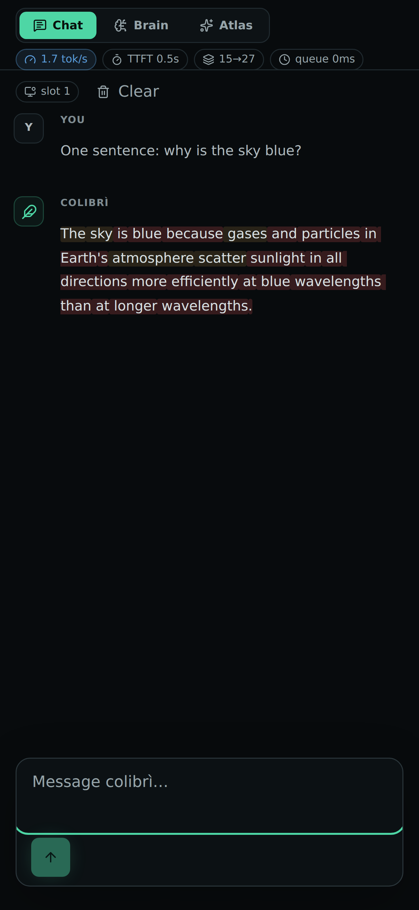
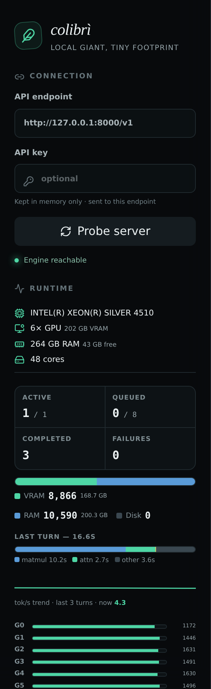

# OpenAI-compatible API, KV contexts & web UI

## `coli serve`

`coli serve` keeps one model process loaded and exposes a text-only
OpenAI-compatible HTTP API. The gateway, scheduler, and engine protocol client
are native C and add no runtime dependencies beyond libc and pthreads.

```bash
cd c
COLI_MODEL=/nvme/glm52_i4 COLI_API_KEY=local-secret ./coli-native serve \
  --host 127.0.0.1 --port 8000 --model-id glm-5.2

curl http://127.0.0.1:8000/v1/chat/completions \
  -H 'Authorization: Bearer local-secret' \
  -H 'Content-Type: application/json' \
  -d '{
    "model": "glm-5.2",
    "messages": [{"role": "user", "content": "Hello"}],
    "stream": true
  }'
```

Implemented endpoints are `GET /v1/models`, `GET /v1/models/{model}`,
`POST /v1/chat/completions`, `POST /v1/responses`, Anthropic-compatible
`POST /v1/messages`, and legacy `POST /v1/completions`. They support JSON
responses, SSE streaming, usage counts,
`max_tokens`/`max_completion_tokens`, `temperature`, and `top_p`. The extension
`enable_thinking: true` enables GLM-5.2's reasoning block; the standard
`reasoning_effort` field also enables it unless set to `none`. DeepSeek clients
may use `think: false` or `thinking: {"type": "disabled"}`. Reasoning is
returned separately as `reasoning_content` in the OpenAI chat API and as
thinking blocks in the Anthropic API.

### Claude Code via the Anthropic API

The gateway implements the Anthropic inference surface needed by Claude Code:
`POST /v1/messages`, Anthropic SSE events, tool-use/tool-result blocks, extended
thinking blocks, `POST /v1/messages/count_tokens`, model discovery, Anthropic
error envelopes and both `x-api-key` and Bearer authentication. Administrative
APIs such as batches, files, billing and organizations are intentionally not
implemented.

Point Claude Code at the server and select Colibri's advertised model id:

```bash
export ANTHROPIC_BASE_URL=http://127.0.0.1:8000
export ANTHROPIC_API_KEY=local                 # match COLI_API_KEY, or any value if unset
export ANTHROPIC_MODEL=glm-5.2
export ANTHROPIC_DEFAULT_HAIKU_MODEL=glm-5.2
export API_TIMEOUT_MS=2147483647               # long prefill can exceed Claude Code's default
claude
```

The token-count endpoint is an estimate (`x-colibri-token-count: estimated`)
because the current engine wire protocol has no tokenizer RPC. Completed
generation usage is exact. Claude Code may disable MCP tool search for a custom
`ANTHROPIC_BASE_URL`; its ordinary built-in tools and explicitly configured MCP
servers continue to work.

### Ollama-compatible API

Ollama clients can use the same host directly. Implemented endpoints are
`POST /api/chat`, `POST /api/generate`, `POST /api/show`, `GET /api/tags`,
`GET /api/ps`, and `GET /api/version`. Chat/generate support JSON and NDJSON
streaming, tools, separate thinking output, the common `options` fields
`num_predict`, `temperature` and `top_p`, and the Colibri `cache_slot` extension.

```bash
curl http://127.0.0.1:8000/api/chat -d '{
  "model": "glm-5.2",
  "messages": [{"role": "user", "content": "Hello"}],
  "stream": false
}'
```

Colibri is a text-generation runtime, not an Ollama model store. Pull, push,
create, copy, delete, embeddings and image inputs are not implemented; unknown
endpoints return Ollama-shaped errors.

Use `--model-alias` for additional advertised ids and
`--hidden-model-alias` for accepted compatibility ids. `--default-thinking`
enables reasoning when the request has no explicit thinking control. The
service example in `ops/` advertises `deepseek-v4-flash` and
`deepseek-v4-pro`, while accepting hidden non-thinking alias `deepseek-chat`.

The server is deliberately text-only. The
744B model stays in one persistent process, so concurrent HTTP requests queue
or use separately allocated KV slots instead of loading duplicate model copies.
Image/audio input, custom stop sequences, log probabilities, and token penalties return an explicit error
rather than being silently ignored. The default bind address is localhost; set
`COLI_API_KEY` before exposing the server beyond the machine.

Browser access from the Vite development server and Tauri local origins is
enabled by default. Repeat `--cors-origin https://your-ui.example` to allow
another exact origin, or use `--cors-origin '*'` only on a trusted local
network.

The engine owns its KV contexts, so HTTP generation uses a bounded FIFO
admission queue instead of pretending to run unsafe parallel sequences.
Configure it with `--max-queue N` (default 8) and `--queue-timeout SECONDS`
(default 300), or the `COLI_MAX_QUEUE` / `COLI_QUEUE_TIMEOUT` environment
variables. Saturated and timed-out requests receive OpenAI-shaped HTTP 429
errors before streaming headers are sent. `GET /health` exposes
active/queued/completed/rejected counters, and successful generation responses
include `x-colibri-queue-wait-ms`.

## Connect a coding CLI or editor

The API is OpenAI-compatible, so most coding CLIs and editor extensions work by
pointing them at Colibri as an *OpenAI-compatible* provider. Three settings:

- **Base URL** — `http://localhost:8000/v1`
- **Model** — `glm-5.2` (or whatever you pass to `--model-id`)
- **API key** — any non-empty string, e.g. `local`

Colibri needs **no** API key by default, but many clients refuse to start without
one — give them any dummy value. The key is only enforced if you set `COLI_API_KEY`.

Smoke-test the endpoint first (no key needed unless you set one):

```bash
curl http://127.0.0.1:8000/v1/chat/completions \
  -H 'Content-Type: application/json' \
  -d '{"model":"glm-5.2","messages":[{"role":"user","content":"hi"}]}'
```

**aider**

```bash
export OPENAI_API_BASE=http://localhost:8000/v1
export OPENAI_API_KEY=local
aider --model openai/glm-5.2     # the openai/ prefix routes to OPENAI_API_BASE
```

**crush** — add a provider to `crush.json` (`~/.config/crush/crush.json`, or
`%USERPROFILE%\AppData\Local\crush\crush.json` on Windows):

```json
{
  "$schema": "https://charm.land/crush.json",
  "providers": {
    "colibri": {
      "name": "Colibri",
      "type": "openai-compat",
      "base_url": "http://localhost:8000/v1/",
      "api_key": "local",
      "models": [
        { "name": "GLM-5.2 (Colibri)", "id": "glm-5.2",
          "context_window": 131072, "default_max_tokens": 1024 }
      ]
    }
  }
}
```

The `"api_key": "local"` dummy is what satisfies clients that demand a key.
`context_window` is only the client's budget display — set it to whatever your
KV configuration actually allows.

**Continue, Cline / Roo, `llm`, the OpenAI SDKs, …** — set the provider's base
URL to `http://localhost:8000/v1`, the model to `glm-5.2`, and any dummy
key (`OPENAI_API_KEY` / `OPENAI_BASE_URL` for env-based tools).

> **Set your expectations before connecting an agentic CLI.** Two costs dominate,
> and the first one is invisible until you know it's there:
>
> 1. **Prefill.** Coding agents (crush, aider in repo-map mode, Cline, …) send a
>    large system prompt plus tool definitions — often 10–20k tokens — *before
>    your first word*. Prefill on the CPU-streaming path runs at a few tokens per
>    second (it is attention-bound, see #153), so a 15k-token agent preamble is
>    **an hour of silent "thinking" before the first output token**. The client
>    looks hung; it isn't. Smoke-test with the tiny `curl` above first — if that
>    answers in about a minute, the pipeline works and what you're paying for is
>    prompt size.
> 2. **Decode.** Roughly 1 tok/s for a large model, so multi-turn agent loops
>    (which re-pay the growing context every turn) compound the cost.
>
> Practical guidance: single surgical asks with a short context work; iterative
> agent sessions against a disk-streaming 744B model do not resemble a hosted
> API and mostly won't be worth the wait. If your client lets you trim or disable
> its system preamble and tool catalog, do it.

## Isolated KV contexts

`coli serve --kv-slots N` allocates up to 16 independent sequence contexts.
Requests select one with the optional integer `cache_slot` field; ordinary
OpenAI clients omit it and keep the original slot 0 behavior.

```json
{
  "model": "glm-5.2",
  "messages": [{"role": "user", "content": "Continue this conversation"}],
  "cache_slot": 1
}
```

Each slot owns its token history, compressed MLA/DSA KV memory, MTP window, and
crash-safe persistence file (`.coli_kv`, `.coli_kv.1`, ...). The engine matches
each request's tokenized prompt against the slot's history and reuses the common
KV prefix, so stateless HTTP turns keep their cache across requests and even
across engine restarts. Use `COLI_KV_SLOTS=N` as the environment equivalent.
Start small: at the default 4096-token context, every slot costs hundreds of MB.

## Many conversations, one RAM context

For a family server or agent workloads, `COLI_KV_CACHE_GB=N` replaces
RAM-multiplied slots with a bounded disk library while keeping `KV_SLOTS=1`.
Every completed conversation is checkpointed under a content-derived name.
Before each request the engine finds the saved token history with the longest
exact prefix, restores only that prefix, and prefills the remaining suffix.
Shared system/tool prompts therefore reuse the same model state across unrelated
clients without exposing or attending to either conversation's private tail.

```bash
COLI_KV_SLOTS=1 \
COLI_KV_CACHE_GB=512 \
COLI_KV_CACHE_DIR=/persistent/colibri-kv \
./coli serve --model /path/to/model
```

Snapshots are immutable and published with temp-file + rename, so branching
conversations cannot overwrite a shared prefix. The oldest snapshots are
evicted after checkpoints until the steady-state budget is met; atomic
publication can temporarily require one additional snapshot's worth of disk.
The directory contains token ids and activations, so permissions are restricted
to the service user and the directory must be treated as conversation data.
Use one cache directory per running engine; the library is single-writer.
This mode is currently available in the mux/OpenAI service, not interactive
`coli chat`.

## Web dashboard

One command serves the OpenAI-compatible API **and** the web console on the
same port, then opens your browser when the engine is ready:

```bash
cd web && npm install && npm run build   # once
./coli web --model <model-dir>
```

What you get:

- **Chat** with live metrics: a flashing token counter while generating, then
  tok/s, time-to-first-token, prompt→completion counts and queue wait;
- **Runtime panel**: your hardware (CPU, GPUs + VRAM, RAM, cores), the
  scheduler, and the live expert-tier bar — how many of the 19,456 experts sit
  in VRAM / RAM / disk right now;
- **Brain**: the whole model as a 76×256 cortex, one cell per expert. Colour =
  tier, brightness = routing heat, and the experts routed in each turn flash
  white and decay — you watch the model think. Hover any cell for its tier,
  heat and [measured topic affinity](https://github.com/JustVugg/colibri/issues/175);
- **Atlas**: the measured expert atlas as a 3-D galaxy (publish `experts.json`
  from `tools/expert_atlas/analyze.py --web`).

The dashboard talks to the engine over a small line protocol and plain JSON
endpoints — nothing heavier than the engine itself. `web/` is a pure OpenAI-API
client (React + TypeScript) and also works against any other compatible
endpoint; the terminal `coli chat` remains the first-class interface.

The layout is responsive down to phone widths, and the sidebar carries the full
telemetry stack — hardware, scheduler, tier bar, per-turn time breakdown, tok/s
trend and per-GPU expert counts:

<p align="center">
  
  &nbsp;&nbsp;
  
</p>
